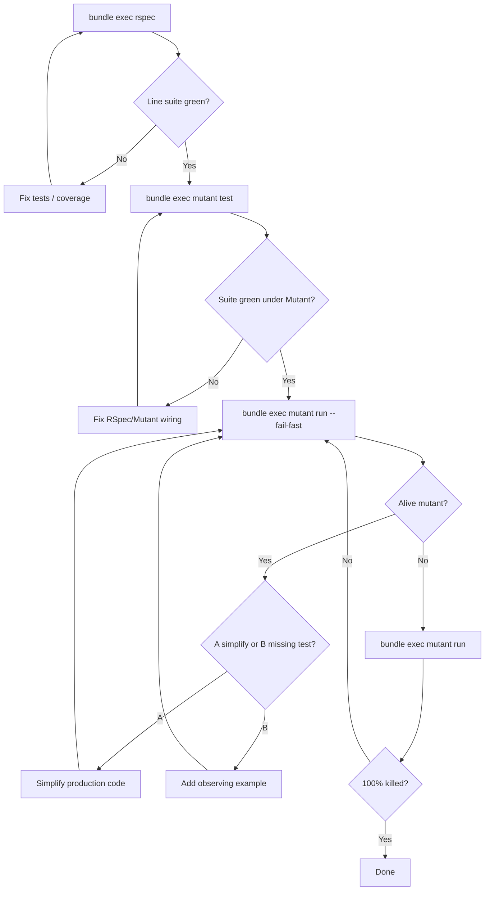

# Task: mutation-testing

* Task ID: mutation-testing
* Complexity: Level 3
* Type: feature / tooling

Add Mutant mutation testing to jekyll-auto-thumbnails using the jekyll-llms pattern, adapted for RSpec (`mutant-rspec`), with a draft PR that can later template the same rollout for sibling gems.

## Pinned Info

### Mutant workflow (RSpec)

How agents and humans exercise Mutant after setup — mirrors jekyll-llms discipline with RSpec-specific commands.

## Component Analysis

### Affected Components

- **Dev dependencies (`jekyll-auto-thumbnails.gemspec` / `Gemfile.lock`)**: declare `mutant ~> 0.16` and `mutant-rspec ~> 0.16` → already started in plan-phase PoC (resolved 0.16.3).
- **Mutant config (`config/mutant.yml`)**: new — `usage: opensource`, `integration.name: rspec`, includes `lib`+`spec`, require shim, matcher `JekyllAutoThumbnails*` → PoC file in place.
- **Mutant require shim (`spec/support/mutant_setup.rb`)**: new — `require "jekyll-auto-thumbnails"` → PoC file in place.
- **Spec bootstrap (`spec/spec_helper.rb`)**: gate SimpleCov with `unless defined?(Mutant)` → PoC change in place.
- **Agent guidance (`AGENTS.md`)**: new — port jekyll-llms policy for RSpec (`bundle exec rspec`, `mutant test`, `mutant run`); forbid ignore cheats / private `.send` for Mutant.
- **Ignore rules (`.gitignore`)**: add `/.mutant/`.
- **Contributor docs (`CONTRIBUTING.md`)**: document Mutant commands (optional but useful for the reference PR).
- **Production lib (`lib/jekyll-auto-thumbnails/**/*.rb`)**: simplify redundant behavior when Mutant survivors indicate over-implementation (bucket A).
- **Specs (`spec/**/*_spec.rb`)**: add examples for intentional behavior Mutant finds unobserved (bucket B); add `HtmlParser` describe if needed for subject selection; refactor existing `.send` private probes when they conflict with AGENTS rules.
- **CI**: no Mutant job in first PR (match jekyll-llms — local/agent-driven).

### Cross-Module Dependencies

- Mutant loads `config/mutant.yml` → requires `mutant_setup` → loads gem → RSpec loads `spec_helper` (SimpleCov skipped under Mutant) → selects examples by describe-prefix for each `JekyllAutoThumbnails*` subject.
- Kill loop couples lib changes to specs: survivors drive either simplification or new examples; both must keep `bundle exec rspec` green.

### Boundary Changes

- No public gem API changes intended.
- Possible internal simplifications (private helpers, redundant casts/guards) when bucket A applies.
- Spec-only surface may grow (`HtmlParser` examples; public-path coverage replacing `.send`).

### Invariants & Constraints

- Public AGPL OSS repo → `usage: opensource` is valid ([Mutant pricing / OSS](https://github.com/mbj/mutant)).
- Mutant 0.16.x is current; RSpec integration first-class — not deprecated.
- No matcher ignores / `coverage_criteria` cheats.
- No `send`/`__send__` on private methods to kill mutants; no stubbing the SUT for Mutant.
- Keep RSpec (no minitest migration).
- Existing Identity-return / HTML rewrite invariants in `systemPatterns.md` must not be broken by simplifications.

## Open Questions

None — implementation approach is clear after research + PoC.

Resolved during planning (not creative-phase):

- **Test framework**: keep RSpec; use `mutant-rspec` (operator-approved).
- **CLI**: Mutant 0.16.3 uses `bundle exec mutant test` (not older docs’ `mutant test run`) and `bundle exec mutant run` for mutation analysis.
- **PR scope**: wire Mutant + AGENTS discipline and drive toward **100% mutation coverage** in this PR (jekyll-llms-faithful reference).
- **CI**: omit Mutant from CI for this PR (same as jekyll-llms).
- **Line coverage gate**: keep SimpleCov CI formatter behavior; do **not** newly enforce `minimum_coverage 100` unless the suite already meets it after kill work — CONTRIBUTING soft target remains unless Mutant work naturally reaches 100% line coverage.

## Test Plan (TDD)

### Behaviors to Verify

- **Deps resolve**: `bundle install` with `mutant` + `mutant-rspec` ~> 0.16 → lockfile includes 0.16.x.
- **Mutant loads config**: `bundle exec mutant test` → RSpec integration, discovers specs, all examples pass.
- **SimpleCov gated**: under Mutant, SimpleCov does not start (`defined?(Mutant)` path); under plain `rspec`, coverage still writes.
- **Subjects matched**: `bundle exec mutant run` mutates `JekyllAutoThumbnails*` subjects (not unrelated constants).
- **Alive mutant A**: removing redundant production code keeps `rspec` + progresses Mutant kill rate.
- **Alive mutant B**: adding an observing example kills the survivor without private `.send`.
- **Regression**: full `bundle exec rspec` stays green after each kill cycle; RuboCop stays clean on touched files.
- **Edge — HtmlParser**: if Mutant reports uncovered/poorly selected `HtmlParser` subjects → add `RSpec.describe JekyllAutoThumbnails::HtmlParser` examples exercising parse dispatcher.
- **Edge — private helpers**: existing `.send` examples in hooks/imagemagick specs must not be the Mutant kill strategy; prefer public-path coverage or simplify.

### Test Infrastructure

- Framework: RSpec (`bundle exec rspec`, `.rspec`, `spec/spec_helper.rb`)
- Test location: `spec/*_spec.rb` mirroring `lib/jekyll-auto-thumbnails/`
- Conventions: `RSpec.describe JekyllAutoThumbnails::Foo`, nested `describe "#method"` / `".method"`
- New test files: likely `spec/html_parser_spec.rb` if needed; otherwise extend existing specs
- Mutant verification (not RSpec): `bundle exec mutant test`, `bundle exec mutant run --fail-fast`, `bundle exec mutant run`

### Integration Tests

- Mutant × RSpec: full suite under `mutant test` (already green in PoC: 98/98).
- Mutant × lib: end-state `mutant run` reports full coverage (0 alive).

## Implementation Plan

1. **Tooling scaffold (PoC largely done — finalize & document)** ✅
    - Files: `jekyll-auto-thumbnails.gemspec`, `Gemfile.lock`, `config/mutant.yml`, `spec/support/mutant_setup.rb`, `spec/spec_helper.rb`, `.gitignore`
    - Changes: ensure deps locked; add `/.mutant/` to gitignore; keep PoC wiring; verify `bundle exec rspec` + `bundle exec mutant test` green

2. **Agent / contributor guidance** ✅
    - Files: `AGENTS.md` (new), `CONTRIBUTING.md` (Mutant section)
    - Changes: port jekyll-llms kill discipline; document `mutant test` / `mutant run` / `--fail-fast`; note opensource usage

3. **Baseline mutation run**
    - Files: none initially
    - Changes: run `bundle exec mutant run --fail-fast`; capture first survivors; prioritize by subject

4. **Kill loop (TDD per survivor)**
    - Files: relevant `lib/...` and/or `spec/...`
    - Changes: for each alive mutant decide A vs B; write failing observation (if B) or simplify (if A); re-run `--fail-fast`; repeat until clean
    - Special: add `spec/html_parser_spec.rb` when HtmlParser subjects need a describe; refactor `.send` private probes when they block AGENTS compliance

5. **Final verification**
    - Commands: `bundle exec rspec`, `bundle exec rubocop` (touched paths / full), `bundle exec mutant test`, `bundle exec mutant run`
    - Changes: none if green

6. **Draft PR**
    - Branch: `feat/mutation-testing` (already created from updated `main`)
    - Deliverable: `gh pr create --draft` summarizing Mutant setup + coverage outcome; note as reference for highlight-cards / mermaid-prebuild

## Technology Validation

**New dependencies:** `mutant ~> 0.16`, `mutant-rspec ~> 0.16` (resolved **0.16.3**).

**PoC results (2026-07-18):**

- `bundle install` succeeded.
- Minimal `config/mutant.yml` + `spec/support/mutant_setup.rb` + SimpleCov gate applied.
- `bundle exec mutant test` → Integration rspec, **98 tests, 0 failed**, ~0.67s runtime.
- Approach currency: Mutant actively maintained (0.16.x, Apr 2026); OSS free via `usage: opensource`; RSpec integration documented and working — not deprecated/superseded.

## Challenges & Mitigations

- **Many survivors / long kill loop**: Use `--fail-fast`; one mutant at a time; prefer simplify (A) when behavior is unneeded.
- **ImageMagick / tmp-dir heavy examples under Mutant**: Expect slower `mutant run`; keep jobs reasonable; do not add CI Mutant yet.
- **Private `.send` in existing specs**: Do not use as Mutant strategy; cover via public API or simplify visibility/implementation.
- **Missing HtmlParser describe**: Add dedicated examples if Mutant cannot select tests via prefix match.
- **Accidental rewrite-path breakage**: Re-run hooks/scanner specs after any Hooks/HtmlParser simplification; preserve identity-return invariants from `systemPatterns.md`.
- **Docs drift (`mutant test run`)**: AGENTS/CONTRIBUTING must document 0.16 CLI (`mutant test`, not `test run`).

## Preflight Findings

- **PASS** — plan aligns with RSpec layout, jekyll-llms Mutant pattern, and OSS `usage: opensource`.
- No convention conflicts: `config/mutant.yml`, `spec/support/`, root `AGENTS.md` match established/reference layouts.
- Downstream impact accounted for: kill loop may touch all `lib/` + `spec/` subjects; Hooks identity-return invariants called out; CI left unchanged.
- Requirements mapped: investigate ✓, add Mutant+RSpec ✓, mirror discipline ✓, draft PR ✓.
- Advisory (non-blocking): consider a thin `rake mutant` wrapper later for discoverability — jekyll-llms has none; keep CLI-only for reference fidelity unless build discovers pain.

## Status

- [x] Component analysis complete
- [x] Open questions resolved
- [x] Test planning complete (TDD)
- [x] Implementation plan complete
- [x] Technology validation complete
- [x] Preflight
- [ ] Build
- [ ] QA
