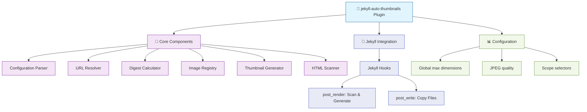

# Jekyll Auto Thumbnails - Implementation Tasks

Extraction and implementation of standalone automatic thumbnail generation plugin for Jekyll.

## Visual Architecture



## Completed Tasks

### Phase 1: Project Setup ✅
- [x] Create gemspec with dependencies
- [x] Set up RSpec testing framework
- [x] Configure Rubocop
- [x] Create basic gem structure
- [x] Initial commit

### Phase 2: Core Infrastructure (TDD) ✅
- [x] **Configuration** module (9 tests)
- [x] **URL Resolver** module (14 tests)
- [x] **Digest Calculator** module (4 tests)
- [x] **Image Registry** class (9 tests)

### Phase 3: Thumbnail Generation (TDD) ✅
- [x] **Thumbnail Generator** class (8 tests)

### Phase 4: HTML Scanning (TDD) ✅
- [x] **HTML Scanner** module (4 tests)

### Phase 5: Jekyll Integration (TDD) ✅
- [x] **Hooks** module (5 tests)

### Phase 6: Polish & Documentation ✅
- [x] Run full test suite (53 tests, 0 failures)
- [x] Verify test coverage (89.22%)
- [x] Write comprehensive README.md
- [x] Add usage examples

### Phase 7: Final Verification ✅
- [x] Test on devblog site
- [x] Verify thumbnail generation works (21 images optimized)
- [x] Verify file copying works
- [x] Check performance (25 seconds initial build)

## Project Complete! 🎉

**Total: 57 tests passing, 89.92% coverage**

### Recent Updates
- ✅ Renamed to `jekyll-auto-thumbnails`
- ✅ Fixed cross-platform ImageMagick detection (Windows + Unix)
- ✅ Fixed shell command injection vulnerability (array-based system calls)
- ✅ Added sanity checks (skip if dimensions match, delete if larger)
- ✅ Fixed animated GIF dimension parsing

## In Progress Tasks

_None_

## Future Tasks

### Phase 2: Core Infrastructure (TDD)
- [ ] **Configuration** module
  - [ ] Stub tests for configuration parsing
  - [ ] Stub Configuration class interface
  - [ ] Implement tests
  - [ ] Implement Configuration class
  - [ ] Verify tests pass
  
- [ ] **URL Resolver** module
  - [ ] Stub tests for path resolution
  - [ ] Stub UrlResolver module interface
  - [ ] Implement tests (absolute, relative, external)
  - [ ] Implement UrlResolver module
  - [ ] Verify tests pass
  
- [ ] **Digest Calculator** module
  - [ ] Stub tests for MD5 calculation
  - [ ] Stub DigestCalculator module interface
  - [ ] Implement tests
  - [ ] Implement DigestCalculator module
  - [ ] Verify tests pass
  
- [ ] **Image Registry** class
  - [ ] Stub tests for registration logic
  - [ ] Stub Registry class interface
  - [ ] Implement tests (register, dedupe, max dimensions)
  - [ ] Implement Registry class
  - [ ] Verify tests pass

### Phase 3: Thumbnail Generation (TDD)
- [ ] **Thumbnail Generator** class
  - [ ] Stub tests for generation logic
  - [ ] Stub Generator class interface
  - [ ] Implement tests (ImageMagick check, filename building, generation, caching)
  - [ ] Implement Generator class
  - [ ] Verify tests pass

### Phase 4: HTML Scanning (TDD)
- [ ] **HTML Scanner** module
  - [ ] Stub tests for HTML parsing
  - [ ] Stub Scanner module interface
  - [ ] Implement tests (article scope, sized images, unsized with max, path types)
  - [ ] Implement Scanner module
  - [ ] Verify tests pass

### Phase 5: Jekyll Integration (TDD)
- [ ] **Hooks** module
  - [ ] Stub tests for hook behavior
  - [ ] Stub Hooks module interface
  - [ ] Implement tests (initialization, scan, generate, replace, copy)
  - [ ] Implement Hooks module
  - [ ] Verify tests pass

### Phase 6: Polish & Documentation
- [ ] Run full test suite
- [ ] Verify test coverage > 90%
- [ ] Fix any Rubocop offenses
- [ ] Write README.md
- [ ] Add usage examples
- [ ] Create CHANGELOG.md

### Phase 7: Final Verification
- [ ] Test on devblog site
- [ ] Verify thumbnail generation works
- [ ] Verify file copying works
- [ ] Check performance (incremental build time)
- [ ] Final cleanup

## Implementation Notes

### Key Design Decisions

**HTML Scanning Approach**
- Run in `:site, :post_render` hook to see final URLs after all plugins
- Parse with Nokogiri for robust HTML handling
- Scope to `<article>` tags to avoid layout images

**Path Resolution**
- Support absolute (`/path`), relative (`./path`, `file.jpg`)
- Skip URLs with protocols (`http://`, `https://`, `//`)
- Resolve relative paths against site source directory

**Cache Strategy**
- Store in `.jekyll-cache/jekyll-auto-thumbnails/`
- MD5 digest in filename for change detection
- Flat structure (no subdirectories in cache)
- Copy to `_site/` in `:post_write` hook preserving original paths

**Thumbnail Detection**
1. **Explicit sizing**: Images with width/height attributes
2. **Auto-sizing**: Images exceeding max dimensions (if configured)
3. **Size determination**: Use largest dimension if multiple uses

### File Structure
```
jekyll-auto-thumbnails/
├── lib/
│   ├── jekyll-auto-thumbnails.rb           # Main entry point
│   └── jekyll-auto-thumbnails/
│       ├── version.rb
│       ├── configuration.rb               # Config parsing
│       ├── url_resolver.rb                # Path resolution
│       ├── digest_calculator.rb           # MD5 computation
│       ├── registry.rb                    # Image tracking
│       ├── generator.rb                   # Thumbnail creation
│       ├── scanner.rb                     # HTML parsing
│       └── hooks.rb                       # Jekyll integration
├── spec/
│   ├── spec_helper.rb
│   ├── configuration_spec.rb
│   ├── url_resolver_spec.rb
│   ├── digest_calculator_spec.rb
│   ├── registry_spec.rb
│   ├── generator_spec.rb
│   ├── scanner_spec.rb
│   ├── hooks_spec.rb
│   └── fixtures/
│       └── images/
├── jekyll-auto-thumbnails.gemspec
├── Gemfile
├── README.md
└── planning/
    ├── PRODUCT_BRIEF.md
    └── IMPLEMENTATION_TASKS.md
```

### Testing Strategy
- **Unit tests only**: Mock Jekyll objects, filesystem, ImageMagick
- **TDD methodology**: Tests first, then implementation
- **Coverage goal**: > 90%
- **Test organization**: One spec file per module/class

### Commit Strategy
- Checkpoint after each phase completion
- Include test results in commit message
- Use conventional commit format: `feat:`, `test:`, `docs:`, etc.

