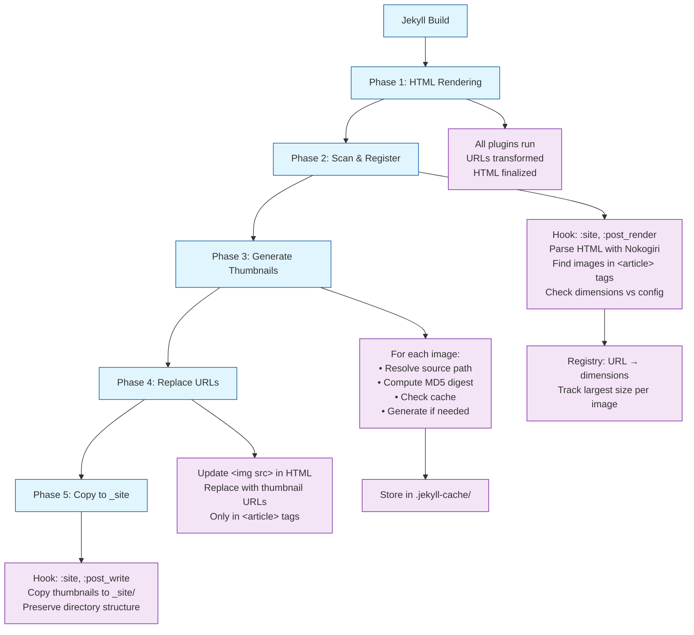

# Jekyll Image Optimizer - Product Brief

## Executive Summary

`jekyll-auto-thumbnails` is a Jekyll plugin that automatically optimizes images for web delivery by generating appropriately-sized thumbnails. It scans rendered HTML for images within `<article>` tags, generates optimized versions with intelligent caching, and seamlessly replaces URLs to serve smaller files to users.

## Problem Statement

Jekyll sites often include large, unoptimized images that slow page load times. Manual image optimization is tedious and error-prone. Existing solutions either:
- Require manual preprocessing of images before adding to the site
- Don't integrate with Jekyll's build process
- Don't handle dynamic sizing requirements
- Break with other Jekyll plugins that transform URLs

## Solution

A Jekyll plugin that:
1. **Automatically detects** images needing optimization by scanning final rendered HTML
2. **Generates thumbnails** at appropriate sizes with intelligent caching
3. **Replaces URLs** transparently in the build process
4. **Works seamlessly** with other Jekyll plugins (runs after all URL transformations)

## Key Features

### 1. Automatic Image Detection

Scans `<article>` tags in rendered HTML for:
- **Explicitly sized images**: Images with `width` and/or `height` attributes
- **Oversized images**: Images exceeding configured maximum dimensions

### 2. Intelligent Thumbnail Generation

- **MD5-based naming**: `{basename}_thumb-{md5}-{width}x{height}.{ext}`
  - Enables change detection and cache invalidation
- **Cached storage**: Generated thumbnails stored in `.jekyll-cache/jekyll-auto-thumbnails/`
- **Format preservation**: Maintains source format (JPEG, PNG, GIF)
- **Quality control**: Configurable JPEG quality (default: 85)

### 3. Path Handling

Supports multiple path types:
- **Absolute paths**: `/assets/images/photo.jpg`
- **Relative paths**: `./photo.jpg` or `photo.jpg`
- **Ignores URLs**: Skips `http://`, `https://`, `//protocol-relative`

### 4. Plugin-Agnostic Design

- **Runs after rendering**: Scans final HTML after all plugins have transformed URLs
- **Compatible with path plugins**: Works with plugins like `image_paths.rb` that transform image URLs
- **Non-invasive**: Only affects images within `<article>` tags

## Architecture



## Configuration

```yaml
# _config.yml
img_optimizer:
  enabled: true  # default: true
  
  # Maximum dimensions for automatic thumbnailing
  # Images exceeding these get thumbnails even without explicit sizing
  max_width: 1200   # pixels (optional)
  max_height: 800   # pixels (optional)
  
  # JPEG quality for generated thumbnails (0-100)
  quality: 85  # default: 85
  
  # Scope to specific HTML elements (default: article)
  scope_selectors:
    - article
```

## Use Cases

### 1. Blog Posts with Photos

```markdown
---
title: My Trip to Japan
---

Look at this beautiful temple:


```

**Result**: 3MB source image → 150KB thumbnail at 400px height

### 2. Automatic Optimization

```yaml
# _config.yml
img_optimizer:
  max_width: 800
```

**Behavior**: Any image over 800px width automatically gets thumbnailed to 800px

### 3. Gallery with Consistent Sizing

```html
<article>
  
  
  
</article>
```

**Result**: All images thumbnailed to 300px width

## Technical Details

### Thumbnail Naming Convention

```
original: photo.jpg
thumbnail: photo_thumb-a3f8e2-300x200.jpg
           └─────┬─────┘ └─┬──┘ └──┬──┘
            basename    MD5   dimensions
```

- **Basename**: Original filename without extension
- **MD5**: First 6 characters of source file's MD5 hash
- **Dimensions**: Width x Height (empty if nil)

### Cache Behavior

1. **First build**: Generate thumbnail, store in cache
2. **Subsequent builds**: Reuse cached thumbnail
3. **Source changed**: MD5 mismatch, regenerate thumbnail
4. **Dimensions changed**: Different filename, generate new size

### Image Processing

Uses **ImageMagick** via shell `convert` command:
- Cross-platform availability
- Reliable performance
- Simple integration
- Graceful fallback if not installed

## Benefits

### For Users
- **Faster page loads**: 70-90% reduction in image size
- **Better mobile experience**: Appropriately sized images
- **Automatic optimization**: No manual intervention

### For Developers
- **Zero configuration**: Works out-of-the-box
- **Build-time optimization**: No runtime overhead
- **Cache-friendly**: Fast incremental builds
- **Plugin-compatible**: Works with existing Jekyll plugins

## Dependencies

### Required
- **Jekyll**: >= 4.0
- **Nokogiri**: ~> 1.15 (HTML parsing)

### Optional
- **ImageMagick**: Required for thumbnail generation (gracefully degrades if missing)

## Future Enhancements

### Potential Features
- **Format conversion**: Optional WebP generation
- **Responsive sets**: Generate multiple sizes with `<picture>` tags
- **Parallel processing**: Speed up generation with multi-threading
- **CDN integration**: Direct upload to CDN
- **Lazy loading**: Add loading attributes automatically

### Non-Goals
- **Original image modification**: Never touches source files
- **Complex transformations**: No filters, effects, or crops
- **Client-side optimization**: Purely build-time

## Success Metrics

- **Page load time**: 40-70% reduction
- **Build overhead**: < 2 seconds for incremental builds
- **Cache hit rate**: > 95% on incremental builds
- **Plugin conflicts**: Zero (runs after all other plugins)

## Installation

```ruby
# Gemfile
group :jekyll_plugins do
  gem "jekyll-auto-thumbnails"
end
```

```bash
bundle install
```

**System requirement**: ImageMagick installed (`convert` command available)

## Backward Compatibility

### With image_paths.rb
- Runs **after** path transformation
- Sees final URLs
- Compatible with any URL-transforming plugin

### With Markdown Image Sizing
- Detects width/height attributes in HTML
- Works with any Markdown processor
- Compatible with extended syntax

## Summary

`jekyll-auto-thumbnails` provides automatic, transparent image optimization for Jekyll sites. By scanning final HTML and generating appropriately-sized thumbnails with intelligent caching, it delivers significant performance improvements without requiring manual intervention or code changes.

**Key Differentiators:**
- ✅ Scans final HTML (plugin-agnostic)
- ✅ Intelligent MD5-based caching
- ✅ Automatic size detection
- ✅ Scoped to content images only
- ✅ Zero configuration required
- ✅ Graceful degradation

**Primary Use Case:** Automatically optimize oversized images in blog posts and content pages for faster load times.

